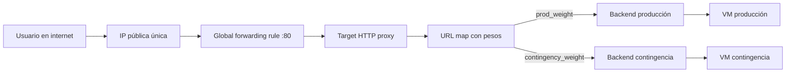

# Proyecto Terraform — Tráfico ponderado en GCP

Infraestructura como código que expone una única IP pública y reparte el tráfico HTTP entre dos servicios independientes, según pesos definidos en `terraform.tfvars`.

## Arquitectura



VPC custom con una subred, dos VMs `e2-micro` sin IP pública, dos grupos de instancia, un health check HTTP, un firewall restringido a los rangos de health-check de Google y un Application Load Balancer externo global. Cada servicio corre en su propia VM: la caída de uno no afecta al otro.

## Requisitos

- Terraform ≥ 1.5 y `gcloud` instalados.
- Cuenta con rol Editor sobre el proyecto `moonlit-buckeye-486820-c0`. El `project_id` ya está fijado en `terraform.tfvars`, por lo que no hay que editar ningún `.tf`.

Autenticación y preparación del proyecto (una sola vez):

```powershell
gcloud auth login
gcloud auth application-default login
gcloud config set project moonlit-buckeye-486820-c0
gcloud services enable serviceusage.googleapis.com compute.googleapis.com --project moonlit-buckeye-486820-c0
```

## Variables

Valores actuales en `terraform.tfvars`:

| Variable | Descripción | Valor |
|---|---|---|
| `project_id` | ID del proyecto GCP. | `moonlit-buckeye-486820-c0` |
| `region` | Región de los recursos. | `us-east1` |
| `zone` | Zona de las VMs. | `us-east1-b` |
| `name_prefix` | Prefijo de nombres de recursos. | `tf-proyecto` |
| `prod_weight` | Peso hacia el servicio principal (0–100). | `100` |
| `contingency_weight` | Peso hacia el servicio de contingencia (0–100). | `0` |

La suma de ambos pesos debe ser mayor que 0. Los pesos son las únicas variables que cambian entre escenarios.

## Despliegue

```powershell
terraform init
terraform apply
terraform output -raw lb_ip
```

Tras el primer `apply`, los backends tardan unos minutos en quedar saludables; durante ese lapso la IP puede responder vacío o con error 502. El estado se consulta con:

```powershell
gcloud compute backend-services get-health "$(terraform output -raw prod_backend_name)" --global --project moonlit-buckeye-486820-c0
gcloud compute backend-services get-health "$(terraform output -raw contingency_backend_name)" --global --project moonlit-buckeye-486820-c0
```

## Escenarios de evaluación

Cada escenario se activa editando **solo** los pesos en `terraform.tfvars` y ejecutando `terraform apply`.

| Escenario | `prod_weight` | `contingency_weight` | Resultado |
|---|---:|---:|---|
| Producción activa | 100 | 0 | Todo el tráfico muestra `Bienvenido al Servicio Principal - Versión Producción` |
| Mantenimiento total | 0 | 100 | Todo el tráfico muestra `Error 503 - Sitio en Mantenimiento Programado` |
| Balance 50/50 | 50 | 50 | Las peticiones alternan entre ambos servicios |

Prueba:

```powershell
$ip = terraform output -raw lb_ip
1..20 | ForEach-Object { curl.exe -s "http://$ip"; "" }
```

## Evidencias

En `evidencias/`: logs de los tres escenarios y de la ejecución final de `terraform destroy`.

## Limpieza

```powershell
terraform destroy
terraform state list   # no debe quedar ningún recurso
```
